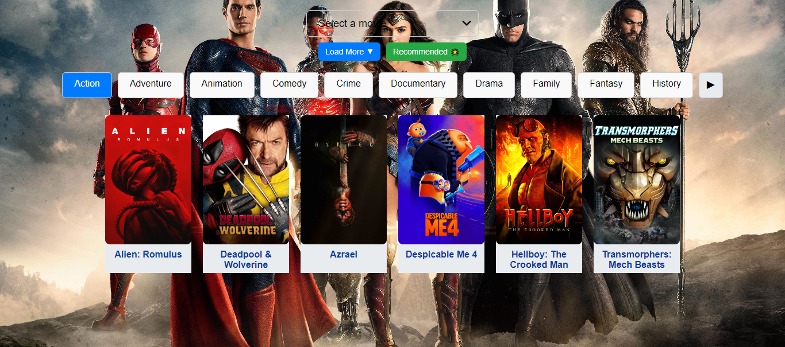
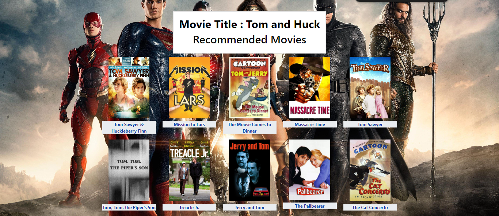

# Movie-Recommender-System
A movie recommendation system uses machine learning (ML) algorithms to predict a user's movie preferences based on their past choices and behavior.

In today’s digital age, movie streaming services like Netflix, Amazon Prime, and others have massive libraries of content that can overwhelm users. A movie recommender system simplifies this by suggesting movies that align with a user’s interests, making content discovery seamless and enjoyable. This Movie Recommender System project leverages the power of machine learning (ML) to predict and recommend movies to users based on their viewing preferences and behavior.
How It Works:
The Movie Recommender System uses algorithms like collaborative filtering and content-based filtering to analyze users' past interactions with movies, such as ratings, likes, and viewing history. It also examines movie metadata, such as genres, actors, and directors, to make personalized recommendations. This system can handle large datasets, allowing it to scale effectively for real-world applications.

The recommendation process can be broken down into two main parts:

1.Collaborative Filtering: This method relies on user interactions and patterns. If two users share similar tastes in movies, the system recommends movies based on what the other user has liked or rated highly. Collaborative filtering builds a relationship between users and movie preferences, learning from similar behavior.

2.Content-Based Filtering: Content-based filtering, on the other hand, focuses on the movie attributes, such as genre, actors, directors, and plot keywords. The system recommends movies that share similarities with the movies the user has watched and enjoyed previously. For example, if a user enjoys science fiction movies featuring a specific actor, the system will recommend similar films from the same genre or with that actor.

The combination of these two methods creates a hybrid recommendation system, providing highly relevant suggestions that meet the user's preferences and interests.

Machine Learning in the Project:
  This project demonstrates key machine learning concepts applied in the real world. The system uses the following machine learning techniques:

  Data Preprocessing: Before applying algorithms, the movie data is cleaned and preprocessed using pandas. This includes handling missing values, encoding categorical features, and normalizing numerical values.

  Similarity Measures: The system employs cosine similarity or Pearson correlation to measure how closely users' preferences match or how similar movies are based on their attributes.

  Matrix Factorization: A powerful technique for collaborative filtering, matrix factorization helps reduce the dimensionality of user-movie interactions, making predictions more efficient and scalable.

Skills Used:
In this project, several essential tools and programming languages have been utilized:

  Python: The core programming language for building the model. Its versatility, ease of use, and vast ecosystem of libraries make it ideal for machine learning tasks.

  Pandas: A crucial library for data manipulation and analysis, pandas simplifies the process of handling large datasets, cleaning data, and preparing it for modeling.

  NumPy: Another powerful library that provides support for large, multi-dimensional arrays and matrices, which is fundamental in the mathematical computations required for machine learning models.

  Flask: Flask is used to develop a lightweight web application that allows users to interact with the recommendation engine. Flask acts as a bridge between the machine learning model and the user interface, where users can input preferences and receive recommendations.

  Tools and IDEs:
For developing and experimenting with the Movie Recommender System, the following tools were used:

Jupyter Notebook: Jupyter is ideal for creating and testing machine learning models due to its flexibility and interactivity. It's widely used for data science tasks, as it allows you to run code snippets and visualize results in real time.

VSCode (Visual Studio Code): For building the Flask web app, VSCode was the preferred IDE, offering features like intelligent code completion, debugging tools, and integrated Git support. VSCode is highly customizable and makes the development process more streamlined.